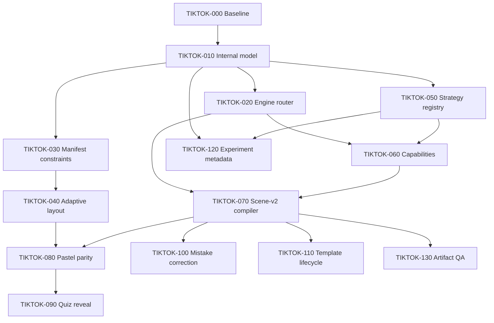

# Dependency Graph

```mermaid
graph TD
  T000[TIKTOK-000 Baseline] --> T010[TIKTOK-010 Internal model]
  T010 --> T020[TIKTOK-020 Engine router]
  T010 --> T030[TIKTOK-030 Manifest constraints]
  T030 --> T040[TIKTOK-040 Adaptive layout]
  T010 --> T050[TIKTOK-050 Strategy registry]
  T020 --> T060[TIKTOK-060 Capabilities]
  T050 --> T060
  T020 --> T070[TIKTOK-070 Scene-v2 compiler]
  T060 --> T070
  T040 --> T080[TIKTOK-080 Pastel parity]
  T070 --> T080
  T080 --> T090[TIKTOK-090 Quiz reveal]
  T070 --> T100[TIKTOK-100 Mistake correction]
  T070 --> T110[TIKTOK-110 Template lifecycle]
  T010 --> T120[TIKTOK-120 Experiment metadata]
  T050 --> T120
  T070 --> T130[TIKTOK-130 Artifact QA]
```
